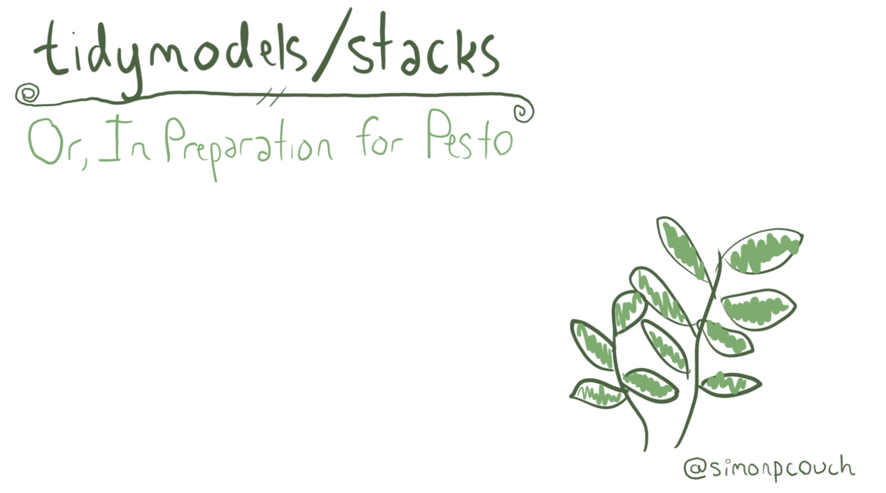

---------------------------------------

This repository contains the source code for my 2021 rstudio::conf talk!

Learn more about {stacks} on the [package website](https://stacks.tidymodels.org), and check out its source code [here](https://github.com/tidymodels/stacks).

To check out the package for yourself, you can install with the following code:

``` r
install.packages("stacks")
```

Install the (unstable) development version with:

``` r
remotes::install_github("tidymodels/stacks", ref = "main")
```


